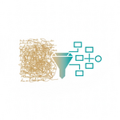
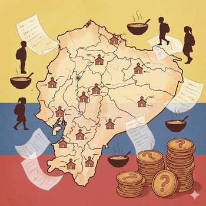

# Selbén

**385.900 formas de escribir mal el nombre de una escuela.**

Este repositorio contiene datos reales del programa SELBEN del Ecuador (2003), un caso de estudio en resolución de nombres de entidad donde nombres de escuelas escritos a mano fueron transcritos por digitadores sin entrenamiento, produciendo uno de los conjuntos de datos más caóticos que jamás encontrarás.

<br clear="both">

---

## La Historia



En 2003, el *Sistema de Selección de Beneficiarios* (SELBEN) del Ecuador administraba encuestas para determinar elegibilidad en programas de ayuda internacional. Uno de estos programas, el PAE (*Programa de Alimentación Escolar*), buscaba complementar la dieta de los estudiantes a través de sus escuelas.

Había un problema.

Los formularios ya habían sido impresos, distribuidos, llenados y recolectados cuando surgió un nuevo requisito: la ayuda debía entregarse a través de las escuelas donde los estudiantes asistían, no directamente a las familias. Los formularios no tenían campo para nombres de escuelas.

La solución fue improvisada. Los formularios fueron devueltos a nivel parroquial. Los nombres de escuelas se agregaron a mano, a veces por encuestadores, a veces por los propios niños. Estos nombres fueron luego transcritos a computadoras por personal de ingreso de datos con distintos niveles de entrenamiento y equipamiento.

<br clear="both">

El resultado: **6,7 millones de registros** que contienen nombres de escuelas con toda variación concebible. La misma escuela podía aparecer como:

```
SIMON BOLIVAR ESC.
SIMON BOLIVAR ESC
SIMON  BOLIVAR  ESC.
ESC. SIMON BOLIVAR
SIMON BOLIVAR/ESC.
SIMON BOLIVAE ESC        ← error tipográfico
```

Mientras tanto, los registros oficiales (SINEC y PAE) listaban solo **~16.000 escuelas**. La proporción de compresión -aproximadamente 25 variantes por escuela real- cuenta la historia de lo que sucede cuando la burocracia se encuentra con la realidad.

Los intentos de agrupar estos nombres usando algoritmos fonéticos como Soundex funcionaron en algunos casos, pero fallaron espectacularmente en muchos otros. El problema quedó sin resolver.

---

## Los Datos

| Archivo | Filas | Descripción |
|---------|-------|-------------|
| `data/encuestas.txt` | 6,7M | Respuestas de encuestas con nombres de escuelas transcritos |
| `data/escuelas_pae.txt` | 15.754 | Registro del programa de alimentación escolar PAE |
| `data/tabla_sinec.txt` | 16.384 | Registro de estadísticas educativas nacionales SINEC |

Todos los archivos están delimitados por tabuladores, en mayúsculas, y usan códigos de ubicación de 6 dígitos (`PPCCRR`: provincia + cantón + parroquia).

### Taxonomía del Ruido

Los nombres transcritos exhiben patrones sistemáticos:

| Tipo | Ejemplo | Causa |
|------|---------|-------|
| Sustitución de caracteres | `M0NTALVO` (cero por O) | Similitud visual |
| Transposición | `FRANCIACO` → FRANCISCO | Error motor |
| Colisión de límite | Nombres terminados en Ñ | Teclado latinoaméricano: Ñ adyacente a `Enter` |
| Variación de clasificador | `ESC`, `ESC.`, `(ESC)`, `/ESC` | Sin formato estándar |
| Marcadores de posición | `SIN NOMBRE ESC` | Desconocido al momento del ingreso |

---

## Qué Es Este Repositorio


Este es un **recurso educativo** para cualquier persona interesada en:

- **Resolución de entidades** — emparejar nombres mal escritos con entidades canónicas
- **Calidad de datos** — entender cómo los datos del mundo real se corrompen
- **Agrupamiento** — agrupar cadenas que refieren a la misma entidad
- **Vinculación de registros** — conectar registros entre conjuntos de datos imperfectos

El código Python de este repositorio explora varios enfoques al problema: normalización, estrategias de bloqueo, métricas de similitud, clusterización y _pipelines_ de transformación trazables.

---

## Estructura

```
data/           # Conjuntos de datos originales (solo lectura)
results/        # Artefactos derivados con seguimiento de linaje
src/            # Código fuente
test/           # Pruebas
bin/            # Scripts utilitarios
```

---

## La Filosofía del _Pipeline_

Cada transformación preserva su linaje:

```
archivos fuente → deduplicados → fusionados → normalizados → firmas → clusters
       ↓              ↓              ↓            ↓            ↓         ↓
   (códigos)      (seq_ids)     (fuente)     (fusión)      (norm)    (firma)
```

Cuando algo sale mal, puedes rastrearlo. Cuando algo sale bien, puedes explicar por qué.

---

## Comenzar

```bash
# Clonar y configurar
git clone https://github.com/xrrocha/selben.git
cd selben
./bin/project-setup.sh
source .venv/bin/activate
```

---

## Licencia

Los datos provienen del extinto programa SELBEN del Ecuador (2003) y no contienen ninguna información personal, solo datos institucionales sobre escuelas (nombres, códigos, ubicaciones). El código se libera bajo la licencia MIT.

---

## Reconocimientos

Este conjunto de datos representa el trabajo de miles de personas a lo largo y ancho del Ecuador que participaron en las encuestas del SELBEN, transcribieron datos bajo condiciones difíciles, e intentaron dar sentido al caos. Sus esfuerzos, aunque imperfectos, buscaban asegurar que los niños recibieran alimentos en la escuela.

Veintidós años después, los datos perviven como herramienta de enseñanza.
