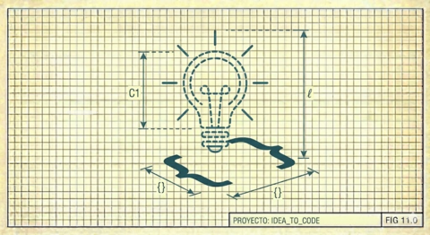

# I. Programar Es Construir Teoría

En 1985, Peter Naur publicó un ensayo que debería haber transformado nuestra disciplina pero fue mayormente ignorado: [*La programación como construcción de teoría*](https://ingenieria-de-software-i.github.io/assets/bibliografia/la-programacion-como-construccion-de-teoria.pdf).

Naur argumenta que **el producto principal de la programación no es el código sino la teoría**, el modelo mental que el programador desarrolla sobre cómo el mundo real se mapea a la solución computacional. El código es un artefacto secundario, una manifestación parcial e incompleta de esa teoría.

Esta distinción no es meramente filosófica. Tiene consecuencias prácticas devastadoras:

1. **La teoría precede al código.** Sin comprensión, no hay implementación válida, solo movimiento aleatorio.

2. **El código no encarna completamente la teoría.** Quien lee el código puede inferir _qué_ hace, pero no _por qué_ así ni _cómo responder_ a modificaciones imprevistas.

3. **El programa "muere" cuando muere la teoría.** Si el equipo que construyó la teoría se disuelve, el programa queda huérfano. Puede seguir ejecutándose, pero está muerto: nadie puede ya modificarlo con confianza.

4. **La resurrección desde documentación es estrictamente imposible.** Naur es enfático: intentar reconstruir la teoría desde el texto del programa o su documentación, por completa que sea, es una tarea inviable. Lo que se escribe nunca captura lo que se sabe.

Esta última observación es particularmente incómoda para quienes creen que la "documentación adecuada" resuelve el problema de continuidad. No lo hace. La teoría vive en las mentes de quienes la construyeron, no en los documentos que dejaron.

---

## Implicación Para la Colaboración Humano-IA

Si la teoría es primaria, entonces **preservar la teoría** es más importante que preservar el código. Esto adquiere urgencia especial cuando uno de los colaboradores es una IA cuya "memoria" es efímera, limitada a una ventana de contexto que eventualmente se compacta o desaparece.

La IA no retiene teoría entre sesiones. Cada conversación comienza desde cero. Esto significa que el humano es, necesariamente, el custodio principal de la teoría. La IA puede ayudar a construirla, articularla, refinarla, pero no puede preservarla por sí sola.

De aquí surge una práctica crucial: documentar no solo resultados sino el proceso de razonamiento compartido. El diálogo, la narrativa del viaje, la bitácora que registra no solo qué hicimos sino por qué y cómo llegamos a cada decisión.

---

[← Preámbulo](00-preambulo.md) | [Inicio](index.md) | [Siguiente →](02-comprension-antes-de-accion.md)
