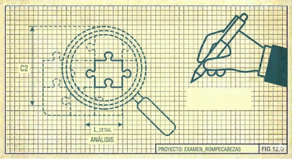

# II. Comprensión Antes de Acción

Naur observa que poseer una teoría significa tener tres capacidades:

1. **Explicar** cómo el mundo real se mapea a la solución computacional.
2. **Justificar** por qué cada parte del programa es como es.
3. **Responder constructivamente** a demandas de modificación o extensión.

La segunda y tercera capacidades son especialmente relevantes. No basta con saber _qué_ hace el código; hay que saber _por qué_ es así y _qué hacer_ cuando las circunstancias cambien.

Esto tiene una consecuencia metodológica directa: **antes de implementar, primero comprender**. No se escribe código para descubrir qué debería hacer el código. Se piensa, se explora, se pregunta. Solo cuando la comprensión es suficiente (no completa, porque nunca lo será, pero sí suficiente), entonces se implementa.

---

## El Protocolo de Confirmación

En la colaboración humano-IA, este principio se vuelve crítico. Una IA puede generar código plausible a velocidad impresionante, pero código plausible no es código correcto. La tentación de "dejar que la IA lo haga" es fuerte, pero el costo de una malinterpretación temprana se multiplica con cada línea construida sobre ella.

Nuestro protocolo:

1. **La IA formula su entendimiento explícitamente** antes de actuar.
2. **El humano confirma** que el entendimiento es correcto, o corrige.
3. **La IA hace preguntas clarificadoras** cuando hay ambigüedad.
4. **Ninguno asume:** si hay duda, se pregunta.

Este protocolo es incómodo. Ralentiza. Parece innecesario cuando la IA "ya sabe" qué hacer. Pero esa certeza aparente es precisamente el problema. La IA puede estar muy segura y muy equivocada simultáneamente.

---

## Ejemplo: Selbén

Cuando encontramos 385,900 cadenas de nombres distintas mapeando a ~16,000 escuelas, la tentación era obvia: implementar un algoritmo de _clustering_ y ver qué pasaba. Una IA sin supervisión habría producido código funcional en segundos. Pero resistimos. Primero miramos. Contamos. Muestreamos. Cuestionamos.

Descubrimos que "SIMON BOLIVAR" aparecía en 30+ variaciones. Que `M0NTALVO` tenía un cero en lugar de O, error de teclado predecible. Que `DUE¥AS` era _mojibake_ de `DUEÑAS`. Que el sufijo `# 47` era una convención municipal de Guayaquil, no ruido aleatorio.

Cada observación refinó nuestra teoría antes de escribir una sola línea de código. Cuando finalmente implementamos, el código fue breve, 17 líneas de lógica, porque la comprensión era profunda.

---

[← Anterior](01-programar-es-construir-teoria.md) | [Inicio](index.md) | [Siguiente →](03-el-viaje-importa.md)
