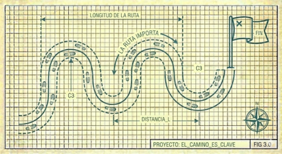

# III. El Viaje Importa Tanto Como el Destino

Si la teoría no puede capturarse completamente en documentación, cómo preservamos aunque sea parte de ella?

Una respuesta parcial: **documentar el viaje, no solo el resultado**. Mantener una bitácora que registre:

- Qué buscamos aprender
- Qué hicimos para aprenderlo
- Qué descubrimos realmente
- Qué inventamos en respuesta
- Qué decisiones tomamos y por qué

Esta narrativa del viaje no es la teoría misma (ningún documento lo es), pero es un índice hacia ella. Quien la lee puede reconstruir, al menos parcialmente, el proceso mental que llevó a cada decisión. Puede preguntarse: "qué habría hecho diferente si las circunstancias fueran distintas?"

---

## La Tensión Fértil

Mantenemos dos documentos paralelos:

1. **La teoría**, que evoluciona, se refina, se corrige. Destila el entendimiento actual.
2. **La bitácora**, que solo crece, nunca se edita. Preserva el camino.

Hay tensión entre ellos. La teoría puede decir "X" hoy cuando ayer decía "Y". La bitácora preserva ambos: el "Y" original y el momento en que descubrimos que debía ser "X". Esta tensión es fértil: referencia cruzada entre ambos documentos revela cómo evolucionó nuestro pensamiento.

---

## Ejemplo: El Conteo de Entidades

Nuestra teoría inicial estimaba ~16,000 entidades canónicas basándose en el archivo PAE. La bitácora registra cuándo descubrimos que PAE y SINEC no son superconjuntos mutuos, que la unión real es 21,534 códigos distintos. La teoría se actualizó; la bitácora preserva el momento del descubrimiento y cómo lo hicimos (`comm -12` sobre archivos ordenados, verificación cruzada de discrepancias).

---

[← Anterior](02-comprension-antes-de-accion.md) | [Inicio](index.md) | [Siguiente →](04-pipeline-trazable.md)
