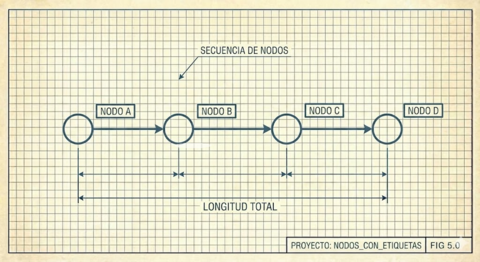

# IV. El _Pipeline_ Trazable



Naur enfatiza que la teoría permite responder a modificaciones. Cómo habilitamos esto en la práctica?

Una respuesta: **preservar linaje en cada transformación**. Cada paso del _pipeline_ de datos debe:

1. Producir un artefacto con identificadores propios.
2. Retener referencias a los identificadores de la etapa anterior.
3. Permitir trazar cualquier registro final hasta su origen.

Esto no es mera contabilidad. Es infraestructura para depuración y validación:

- **Depuración**: Cuando algo falla, podemos preguntar "de dónde vino este registro anómalo?" y rastrear hacia atrás.
- **Validación**: Cuando algo funciona, podemos verificar que los buenos patrones sobrevivieron las transformaciones.

---

## El Contrato de Linaje

Cada archivo derivado incluye:
- Un ID secuencial propio
- Una o más referencias a IDs de la etapa anterior
- Metadatos sobre la transformación (conteos, fusiones)

```
fuente → deduplicado → fusionado → normalizado → firmas → clusters
  ↓          ↓            ↓            ↓            ↓          ↓
(códigos) (seq_ids)   (ids_fuente) (ids_fusión) (ids_norm) (ids_firma)
```

Nadie puede mantener toda la cadena en la cabeza. Pero cualquiera puede seguir los hilos cuando necesite entender un resultado particular.

---

[← Anterior](03-el-viaje-importa.md) | [Inicio](index.md) | [Siguiente →](05-codigo-como-literatura.md)
