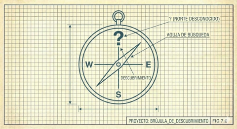

# VI. Curiosidad Sobre Utilidad

Este proyecto no resuelve un problema. El problema original venció hace 22 años. Nadie espera ya estos resultados; nadie los necesita para tomar decisiones.

Entonces por qué hacerlo?

Porque **la curiosidad tiene valor intrínseco**. Porque entender algo profundamente, cómo se degradan los nombres en transcripción manual, cómo emergen patrones sistemáticos del aparente caos, cómo una convención municipal de numeración sobrevive millones de registros, es su propia recompensa.

---

Naur, citando a [Gilbert Ryle](https://en.wikipedia.org/wiki/Gilbert_Ryle) (en inglés), distingue entre "saber qué" (conocimiento proposicional) y "saber cómo" (habilidad práctica). La distinción aparece en [*The Concept of Mind*](https://en.wikipedia.org/wiki/The_Concept_of_Mind) (en inglés), la obra donde Ryle desarma el dualismo cartesiano. Pero hay un tercer modo: **saber por qué**, la comprensión profunda que permite no solo ejecutar sino explicar, no solo repetir sino adaptar.

Este tercer modo es el objetivo de la exploración curiosa. No buscamos entregar funcionalidad. Buscamos comprender, formalizar, y eventualmente enseñar.

---

[← Anterior](05-codigo-como-literatura.md) | [Inicio](index.md) | [Siguiente →](07-contra-la-metodologia-rigida.md)
