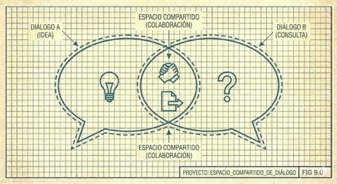

# VIII. El Conocimiento Compartido

[Pelle Ehn](https://mitpress.mit.edu/contributors/pelle-ehn) (en inglés), que Naur cita extensamente, habla de los "[juegos de lenguaje](https://es.wikipedia.org/wiki/Juego_del_lenguaje_(filosof%C3%ADa))" de [Ludwig Wittgenstein](https://es.wikipedia.org/wiki/Ludwig_Wittgenstein): el significado emerge del uso compartido, no de definiciones abstractas. Diseñar software es crear un nuevo juego de lenguaje con los usuarios, un espacio de comunicación donde términos adquieren significado a través de la práctica conjunta.

---

## Juegos de Lenguaje Humano-Máquina

Esta idea adquiere nueva relevancia cuando uno de los participantes es una IA. El significado no está predefinido; emerge del uso. Cuando decimos "dump time" al final de una sesión, esa frase activa un protocolo específico que ambos entendemos. Cuando preguntamos "wdyt?" (what do you think?), significa: pausa, explica tu razonamiento, no actúes todavía.

Estos micro-protocolos no fueron diseñados a priori. Emergieron de la práctica, de malentendidos corregidos, de patrones que funcionaron y se cristalizaron en convención. Son nuestro juego de lenguaje compartido.

Esto tiene implicaciones para otros desarrolladores que trabajan con IA. No basta con dar instrucciones; hay que construir un vocabulario común, corregir malentendidos temprano, establecer señales claras para estados como "estoy pensando en voz alta" vs "hazlo ahora".

---

[← Anterior](07-contra-la-metodologia-rigida.md) | [Inicio](index.md) | [Siguiente →](09-preservacion-continua.md)
