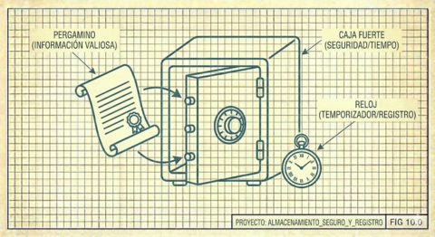

# IX. Preservación Continua

El riesgo más grave no es el fracaso del código sino la pérdida de la teoría. Por eso adoptamos un protocolo de preservación continua.

---

## El Problema de la Memoria Efímera

En colaboración humano-IA, este riesgo se intensifica. La IA no recuerda sesiones anteriores. Cada conversación comienza con contexto limitado, reconstruido desde documentos. Si esos documentos son pobres, la reconstrucción es pobre. Si son ricos, la IA puede retomar el hilo.

Naur observa que el programa "muere" cuando la teoría desaparece. En nuestro caso, la teoría "muere" al final de cada sesión a menos que la preservemos activamente.

---

## El Ritual de Cierre

Por eso, al final de cada sesión:

1. **Actualizar el estado**: Qué quedó pendiente, qué viene después.
2. **Escribir la transcripción**: No un resumen, sino el diálogo literal. El razonamiento compartido, las preguntas, las correcciones.
3. **Registrar en la bitácora**: Si se completó algo sustantivo, agregar una entrada que preserve el "qué aprendimos" y el "cómo lo descubrimos".
4. **Actualizar la teoría**: Si el entendimiento cambió, reflejarlo en el documento vivo.
5. **Comprometer todo**: Nada queda solo en la conversación. Todo queda en texto, bajo control de versiones.

Este ritual es incómodo. Toma tiempo que podría "usarse mejor" escribiendo más código. Pero es precisamente ese tiempo el que preserva la teoría, el que permite que la próxima sesión comience desde donde terminó esta, no desde cero.

---

## Transcripciones vs Resúmenes

Insistimos en transcripciones literales, no resúmenes. Un resumen captura conclusiones; una transcripción captura razonamiento. La diferencia es crucial: el razonamiento revela _por qué_ llegamos a cada conclusión, qué alternativas consideramos, qué dudas tuvimos. Esto es precisamente lo que Naur dice que no puede recuperarse desde documentación... pero se acerca más si el documento es el diálogo mismo.

---

[← Anterior](08-conocimiento-compartido.md) | [Inicio](index.md) | [Siguiente →](10-epilogo.md)
