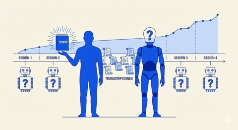

# Epílogo

Naur termina su ensayo observando que la visión de Construcción de Teoría explica por qué algunos métodos aparentemente irracionales, como la integración temprana sin especificación completa, funcionan en la práctica. Funcionan porque mantienen viva la teoría, porque obligan a los participantes a seguir construyendo comprensión compartida.

Cuarenta años después, una nueva pregunta: puede una IA participar en esa construcción compartida?

---

Nuestra experiencia dice que sí, con reservas. La IA puede explorar, proponer, cuestionar, articular. Puede acelerar la construcción de teoría. Pero no puede custodiarla. El humano sigue siendo el portador de la teoría entre sesiones, el que recuerda, el que decide.

Lo que cambia es la intensidad de la documentación requerida. Cuando ambos colaboradores son humanos, mucho conocimiento tácito sobrevive en sus mentes. Cuando uno es una IA, ese conocimiento debe hacerse explícito o se pierde. Paradójicamente, esto produce mejores registros: la necesidad de explicarle todo a la IA obliga a articular lo que de otro modo quedaría implícito.

---

Trabajamos así no porque un libro lo prescribe sino porque la experiencia lo confirma. El código que escribimos sin entender se pudre. Las decisiones que no documentamos se olvidan. Las teorías que no cultivamos mueren con nosotros, o con nuestra sesión.

**La teoría es nuestro santo grial.** El código es solo una sombra. Pero las sombras pueden señalar hacia la luz, si sabemos leerlas.

---

[← Anterior](09-preservacion-continua.md) | [Inicio](index.md)

---

*Este documento es vivo. Evoluciona con nuestra práctica.*
