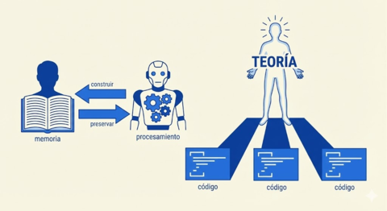

# Filosofía de Trabajo

>  **La teoría es nuestro santo grial.** El código es solo una sombra proyectada por la teoría.

---

**Programar es construir teoría, no código.** El código es sombra; cuando muere la teoría, el programa muere, aunque siga ejecutándose.

De aquí se deriva todo: comprender antes de implementar, documentar el viaje (no solo el destino), preservar linaje en cada transformación, escribir código que se lea.

Este documento fue escrito por un humano y una IA trabajando juntos. Lo revelamos porque la filosofía de Naur, formulada en 1985, resulta guía inesperadamente precisa para esta colaboración: la IA puede co-construir teoría, pero no custodiarla. El humano recuerda; la IA olvida. De esa asimetría emerge un protocolo.

---

## Capítulos

0. [Preámbulo](00-preambulo.md) — El contexto y el problema
1. [Programar Es Construir Teoría](01-programar-es-construir-teoria.md) — La tesis central de Naur
2. [Comprensión Antes de Acción](02-comprension-antes-de-accion.md) — El protocolo de confirmación
3. [El Viaje Importa](03-el-viaje-importa.md) — Documentar el camino, no solo el destino
4. [El _Pipeline_ Trazable](04-pipeline-trazable.md) — Preservar linaje en cada transformación
5. [El Código Como Literatura](05-codigo-como-literatura.md) — Escribir para humanos
6. [Curiosidad Sobre Utilidad](06-curiosidad-sobre-utilidad.md) — Por qué explorar sin deadline
7. [Contra la Metodología Rígida](07-contra-la-metodologia-rigida.md) — Hábitos sobre procesos
8. [El Conocimiento Compartido](08-conocimiento-compartido.md) — Juegos de lenguaje humano-máquina
9. [Preservación Continua](09-preservacion-continua.md) — El ritual de cierre
10. [Epílogo](10-epilogo.md) — Puede una IA participar en la construcción de teoría?

---

*Este documento es vivo. Evoluciona con nuestra práctica.*
